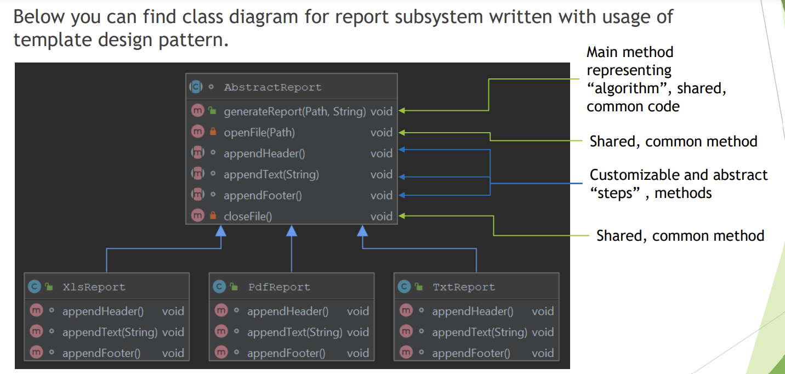
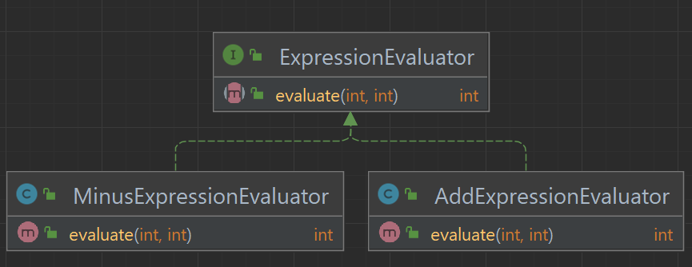

Database Management
-------------------
dependencies
------------


Intro
------
1. Exceptions
   1. Checked
      1. Exception that is extending java.lang.Exception (expect
         java.lang.RuntimeException) class that has to be explicitly declared in
         throws part of method signature of method that is throwing an exception and has
         to be explicitly handled by code that invokes the method. If code that is calling the
         method with checked exception does not handle exception, it has to declare it in
         throws part of method signature.
      2. Pros:
         1. Developer using API always has a list of
            exceptional situations that has to be
            handled
         2. Fast compile-time feedback on check if
            all exceptional situations were handled
      3. Cons:
         1. May result in cluttered code
         2. Coupling between callee and caller
   2. Unchecked
      1. Exception that is extending
         java.lang.RuntimeException class, does not have to be explicitly declared in
         throws part of method signature of method that is throwing an exception and does
         not have to be explicitly handled by code that invokes the method. Developer has
         freedom of choice if error handling should be implemented or not.
      2. Pros:
         1. Reduces cluttered code
         2. Reduces coupling between callee and
            caller
      3. Cons:
         1. May result in missing situations in which
            error handling should be implemented
         2. Lack of compile-time feedback on error
            handling
   3. Spring encourages Runtime exception due to its pros
   4. Spring  data access exception hierarchy
      1. Data Access Exception is a Runtime Exception
      2. Examples of concrete Data Access Exceptions
         1. CannotAcquireLockException
         2. CannotCreateRecordException
         3. DataIntegrityViolationException
      3. Purpose of this hierarchy is to create
         abstraction layer on top of Data Access APIs to
         avoid coupling with concrete implementation
         of Data Access APIs

configure a DataSource
----------------------
1. DataSource
   1. Data Source is represented by generic interface javax.sql.DataSource which represent any
      data source for sql database
   2. To configure data source in Spring you need to create a @Configuration class that will return
      javax.sql.DataSource bean.
   3. You can use for example following types of javax.sql.DataSource:
   4. You can use for example following types of javax.sql.DataSource:
         1. DriverManagerDataSource – basic JDBC driver connection source
         2. BasicDataSource – Apache DBCP for Connection Pooling
         3. ComboPooledDataSource - C3P0 for Connection Pool
2. Configuration of Data Source in Spring is dependent on type of application that is
   executed.
   1. Type of execution:
      1. `Standalone` – Data Source is configured in @Configuration class and is
         created as a bean of one of supported data source types
      2. `Spring Boot `– Data Source is configured through application.properties
3. working with development/test databases, following beans are very useful:
   1. EmbeddedDatabaseBuilder – allows to easily configure H2/HSQLDB embedded
      database with schema/data initialization scripts
   2. DataSourceInitializer / ResourceDatabasePopulator – allows to use
      schema/data initialization scripts without usage of EmbeddedDatabaseBuilder

4. Example for Stand Alone
   1. Using hsqldb in memory database
   2. Example
      ```java
      // configuration - setting up Db config and population of test data
      
      @Configuration
      public class DataSourceConfiguration {
      @Bean
      public DataSource dataSource() {
          BasicDataSource basicDataSource = new BasicDataSource();
          basicDataSource.setDriverClassName("org.hsqldb.jdbcDriver");
          basicDataSource.setUrl("jdbc:hsqldb:mem:localhost");
          return basicDataSource;
      }
      }
      
      @Configuration
      public class DataSourceTestDataConfiguration {

      @Value("classpath:/db-schema.sql")
      private Resource schemaScript;
      @Value("classpath:/db-test-data.sql")
      private Resource dataScript;

      @Bean
      public DataSourceInitializer dataSourceInitializer(@Autowired final DataSource dataSource) {
          final DataSourceInitializer dataSourceInitializer = new DataSourceInitializer();
          dataSourceInitializer.setDataSource(dataSource);
          dataSourceInitializer.setDatabasePopulator(databasePopulator());
          return dataSourceInitializer;
      }

      private DatabasePopulator databasePopulator() {
          final ResourceDatabasePopulator databasePopulator = new ResourceDatabasePopulator();
          databasePopulator.addScript(schemaScript);
          databasePopulator.addScript(dataScript);
          return databasePopulator;
      }
      }  
      
      // Repo - database connected via JdbcTemplate
      @Repository
      public class EmployeeDao {
      private JdbcTemplate jdbcTemplate;

          @Autowired
          public void setDataSource(DataSource dataSource) {
              jdbcTemplate = new JdbcTemplate(dataSource);
          }

          public List<String> findEmployeeEmails() {
              return jdbcTemplate.queryForList(
                "select email from employee",
                String.class
              );
          }
      }
      
      //Service
      
      @Service
      public class EmployeeReportService {

          @Autowired
          private EmployeeDao employeeDao;

          public void printReport() {
              System.out.println("Employee Report Start");

              employeeDao.findEmployeeEmails()
                      .forEach(System.out::println);

              System.out.println("Employee Report Stop");
          }
      }
      
      
         ```
      ```sql
      //db-schema.sql
      create table employee
      (      
      employee_id  int,
      first_name   varchar(32),
      last_name    varchar(32),
      email        varchar(32),
      phone_number varchar(32),
      hire_date    date,
      salary       int
      );
      
      //db-test-data.sql
      insert into employee(employee_id, first_name, last_name, email, phone_number, hire_date, salary)
      values (1, 'John', 'Doe', 'John.Doe@corp.com', '555-55-55', '2019-06-05', 70000),
      (2, 'Willow', 'Zhang', 'Willow.Zhang@corp.com', '555-55-56', '2019-07-12', 80000),
      (3, 'Jayvon', 'Grant', 'Jayvon.Grant@corp.com', '555-55-57', '2019-07-17', 90000),
      (4, 'Shaylee', 'Mcclure', 'Shaylee.Mcclure@corp.com', '555-55-58', '2019-07-19', 120000),
      (5, 'Miley', 'Krueger', 'Miley.Krueger@corp.com', '555-55-59', '2019-07-20', 110000);
      ```
      
5. Example for Spring boot
   1. Data Source is configured through application.properties
   2. database is autoconfigured by springboot
   3. Example
      ```java
      // Configuration is done automatically by SpringBoot by reading application.properties and schema.sql files specified from resources
      
      //application.properties
      spring.datasource.url=jdbc:hsqldb:mem:localhost
      spring.datasource.driver-class-name=org.hsqldb.jdbcDriver
      
      // schema and test data is same as above example
      
      //service
      @Service
      public class EmployeeReportService {

          @Autowired
          private EmployeeDao employeeDao;

          public void printReport() {
              System.out.println("Employee Report Start");

              employeeDao.findEmployeeEmails()
                      .forEach(System.out::println);

              System.out.println("Employee Report Stop");
          }
      }
      
      //REPO
      @Repository
      public class EmployeeDao {
      private JdbcTemplate jdbcTemplate;

          @Autowired
          public void setDataSource(DataSource dataSource) {
              jdbcTemplate = new JdbcTemplate(dataSource);
          }

          public List<String> findEmployeeEmails() {
              return jdbcTemplate.queryForList(
                "select email from employee",
                String.class
              );
          }
      }
      
      //main
      @SpringBootApplication
      @ComponentScan(basePackages = {"dao","service"})
      public class SpringBootConsoleApplication implements CommandLineRunner {

      @Autowired
      private EmployeeReportService employeeReportService;

      public static void main(String[] args) {

          SpringApplication.run(SpringBootConsoleApplication.class, args);
      }
      @Override
      public void run(String... args) throws Exception {
          employeeReportService.printReport();
      }

       }
      
      //dependencies
      implementation group: 'org.springframework.boot', name: 'spring-boot-starter', version: '2.5.3'
      implementation group: 'org.springframework', name: 'spring-jdbc', version: '5.3.9'
      implementation group: 'org.hsqldb', name: 'hsqldb', version: '2.5.0'
      implementation group: 'org.apache.commons', name: 'commons-dbcp2', version: '2.6.0'
      ```
      
   

JDBC Template
-------------
1. Template design pattern 
   1. Template design pattern is a behavioral design pattern that can be used to
      encapsulate algorithm/main flow with it steps in a way to achieve steps
      customization and shared code reusability. 
   2. It is achieved by creating abstract
      class that contains algorithm definition/main flow with shared code, and child
      classes extending abstract class which are customizing step or steps of the
      algorithm.
   3. Note
      1. Template design pattern can be used to achieve greater code reusability,
         however since it is using inheritance, which is very strong relationship between
         classes it can limit future flexibility of the system. You should use this pattern
         with caution and you should analyze if strategy design pattern will not give you
         similar results. Strategy uses composition instead of inheritance and in some
         cases instead of using template method, strategy can be used to achieve code
         reusability and also code flexibility.
   4. Example
      
2. JDBC Template
   1. Jdbc Template is a class located in org.springframework.jdbc.core package.
      Goal of this class is to simplify use of JDBC by providing implementation of JDBC
      workflow, leaving application to provide SQL statements and results extractions.
   2. it cares of open, establishing and closing the connection. you have just provide the quiries to execute
   3. Jdbc Template executes SQL queries or updates, initiates iteration over ResultSet,
      ResultSet mapping, also it catches exceptions and translates them into generic
      exceptions.
   4. Code that interacts with Jdbc Template needs to provide implementation of callback
      interfaces which allows specific steps of JDBC workflow customization:
      1. PreparedStatementCreator
      2. ResultSetExtractor
      3. PreparedStatementSetter
      4. RowMapper
   5. Example
      ```java
      public class EmployeeDao {
      private JdbcTemplate jdbcTemplate;

      @Autowired
      public void setDataSource(DataSource dataSource) {
      jdbcTemplate = new JdbcTemplate(dataSource);
      }

      public List<Employee> findEmployees() {
      return jdbcTemplate.query(
      "select employee_id, first_name, last_name, email, phone_number, hire_date, salary from employee",
      this::mapEmployee
      );
      }

      public Employee findFirstHiredEmployee() {
      return jdbcTemplate.queryForObject(
      "select * from employee order by hire_date limit 1",
      this::mapEmployee
      );
      }

      public Employee findEmployeeWithHighestSalary() {
      return jdbcTemplate.queryForObject(
      "select * from employee order by salary desc limit 1",
      this::mapEmployee
      );
      }

      public int findEmployeesCount() {
      return jdbcTemplate.queryForObject(
      "select count(*) from employee",
      Integer.class
      );
      }   

      @SneakyThrows
      private Employee mapEmployee(ResultSet resultSet, int i) {
      return new Employee(
      resultSet.getInt("employee_id"),
      resultSet.getString("first_name"),
      resultSet.getString("last_name"),
      resultSet.getString("email"),
      resultSet.getString("phone_number"),
      resultSet.getDate("hire_date"),
      resultSet.getFloat("salary")
      );
      }
      }
      ```
Jbbc Call backs
   -------------
1. Callback
   1. A callback is a code or reference to the code that can be passed as an argument
      to the method. This method will execute passed callback during execution.
      1. On Java level callback can be:
         1. Class that implements interface
            Example
            
            ```java
            // function that accepts callback
            numbersEvaluator.evaluate(4, expressionEvaluator, valuePrinter);
            
            ExpressionEvaluator expressionEvaluator = new AddExpressionEvaluator();

             ```
         2. Anonymous class
            ```java
            ExpressionEvaluator expressionEvaluator = new ExpressionEvaluator() {
            @Override
            public int evaluate(int a, int b) {
                return a * b;
            }
            };
             ```
         3. Lambda expression – JDK 8
               ````java
            ExpressionEvaluator expressionEvaluator = (a, b) -> a + b;

              ````
         4. Reference Method – JDK 8
            ```java
            ExpressionEvaluator expressionEvaluator = this::powEvaluator;

            ```
2. Jdbc Template Callbacks that can be used with queries:
   1. RowMapper
      1. interface for processing ResultSet data on per-row basis,
         implementation should call ResultSet.get*(..) methods, **but should not call
         ResultSet.next()**, it should only extract values from current row and based on
         those values should create object, which will be returned from mapRow method,
         implementation is `usually stateless`.
      2. implementing the `mapRow(ResultSet resultSet, int rowNum)` method
      3. Example
         ```java
            //using RowMapper Interface
            public List<Employee> getEmployeeList()
            {
            return jdbcTemplate.query("select employee_id, first_name, last_name, email, phone_number, hire_date,          salary from employee", new RowMapper<Employee>() {
            @Override
            public Employee mapRow(ResultSet resultSet, int rowNum) throws SQLException {
            return new Employee(
            resultSet.getInt("employee_id"),
            resultSet.getString("first_name"),
            resultSet.getString("last_name"),
            resultSet.getString("email"),
            resultSet.getString("phone_number"),
            resultSet.getDate("hire_date"),
            resultSet.getFloat("salary")
            );
            };
            });
            }


         ```
   2. RowCallbackHandler
      1. interface for processing ResultSet data on a per-row
         basis, implementation should call ResultSet.get*(..) methods, but should
         **not call ResultSet.next()**, it should only extract values from current row,
         implementation is usually `stateful`, it keeps accumulated data in some object,
         processRow method from this class does not return any value, instead method
         saves results into for example object field that will keep state
      2. by implementing the `processRow(ResultSet)` method
      3. Example
         ```java
         public float findAverageSalaryRowByRow() {
         AverageSalaryRowCallbackHandler averageSalaryRowCallbackHandler = new AverageSalaryRowCallbackHandler();

         jdbcTemplate.query(
         "select salary from employee",
         averageSalaryRowCallbackHandler
         );

         return averageSalaryRowCallbackHandler.getAverageSalary();
         }
         
         //CallBack
         class AverageSalaryRowCallbackHandler implements RowCallbackHandler {
         private float salarySum = 0;
         private int salariesCount = 0;

         @Override
         public void processRow(ResultSet rs) throws SQLException {
         salarySum += rs.getFloat("salary");
         ++salariesCount;
         }

         public float getAverageSalary() {
         return salarySum / (float) salariesCount;
         }
         }

         ```
   3. ResultSetExtractor
      1. – interface for processing entire ResultSet data, all
         rows needs to be processed and implementation `should call ResultSet.next()`
         method to move between rows, implementation is usually stateless,
         implementation should not close ResultSet, it will be closed by Jdbc Template
      2. should implement `extractData(ResultSet rs)` method
      3. Example
         ```java
         //callback
         class AverageSalaryResultSetExtractor implements ResultSetExtractor<Float> {
         @Override
         public Float extractData(ResultSet rs) throws SQLException, DataAccessException {
         float salarySum = 0;
         int salariesCount = 0;

               while (rs.next()) {
                   salarySum += rs.getFloat("salary");
                   ++salariesCount;
               }

               return salarySum / (float) salariesCount;
         }
         }

         ```
         
   4. Jdbc Template other Callbacks:
      1. PreparedStatementCreator
         1. should create PreparedStatement based on
            Connection provided by JdbcTemplate, implementation should provide SQL
            and parameters
      2. PreparedStatementSetter
         1. should set values on PreparedStatement
            provided by JdbcTemplate, implementation should only set parameters, SQL will
            be set by JdbcTemplate
      3. Example of 
         ```java
         public int findEmployeeIdFromEmail(String email) {
            return jdbcTemplate.query(
            new PreparedStatementCreator() {
            @Override
            public PreparedStatement createPreparedStatement(Connection con) throws SQLException {
            return con.prepareStatement("select employee_id from employee where email = ?");
            }
            },
            new PreparedStatementSetter() {
            @Override
            public void setValues(PreparedStatement ps) throws SQLException {
            ps.setString(1, email);
            }
            },
            new ResultSetExtractor<Integer>() {
            @Override
         public Integer extractData(ResultSet rs) throws SQLException, DataAccessException {
         if (rs.next())
         return rs.getInt("employee_id");
         else
         throw new SQLException("Unable to find id based on email");
         }
         }
         );
         }
         ```
      4. CallableStatementCreator
         1. should create CallableStatement based on
            Connection provided by JdbcTemplate, implementation should provide SQL
            and parameters
      5. PreparedStatementCallback
         1. used internally by JdbcTemplate –
            generic interface allowing number of operations on single PreparedStatement
      6. CallableStatementCallback 
         1. used internally by JdbcTemplate –
            generic interface allowing number of operations on single CallableStatement


Execution of plain SQL statements - JDBC Template
----------------------------------------------
1. JDBC Template allows execution of plain SQL statements with following
   methods
   1. query
   2. queryForList
      1. returns list of objects of declared type, `expects query to return
         results with only one column`, otherwise
         IncorrectResultSetColumnCountException will be thrown
   3. queryForObject
      1. returns single object, expects query to return only one record, if
         this requirement is not matched
         IncorrectResultSizeDataAccessException will be thrown
   4. queryForMap
      1. returns map for single row with keys representing column names
         and values representing database record value, expects query to return only one
         record, if this requirement is not matched
         IncorrectResultSizeDataAccessException will be thrown
   5. queryForRowSet
      1. returns SqlRowSet object that contains metadata information
         (like column names) and allows to read results data and iterate through records
   6. execute
   7. update
   8. batchUpdate
   9. Most of the methods above have many versions, allowing you to specify not only query
      itself, but also parameters to the query and customer row mapper if required.
   10. Jdbc Template returns objects, lists/map by using following:
       1. objects – queryForObject – SingleColumnRowMapper for generic types and
          RowMapper for custom types
       2. lists – queryForList – SingleColumnRowMapper for generic types
       3. maps – queryForMap – ColumnMapRowMapper for any query
   11. Examples
       ```java
       //query
       public List<Employee> findEmployees() {
         return jdbcTemplate.query(
                 "select employee_id, first_name, last_name, email, phone_number, hire_date, salary from employee",
                 this::mapEmployee
            );
         }
      
       //queryForList
       public List<String> findEmployeesEmails() {
         return jdbcTemplate.queryForList("select email from employee", String.class);
          }
       
        //OUT PUT - John,Jayvon, ...
       
       //queryForObject
       public Employee findEmployeeWithHighestSalary() {
         return jdbcTemplate.queryForObject(
                 "select employee_id, first_name, last_name, email, phone_number, hire_date, salary from employee order by salary desc limit 1",
                 this::mapEmployee
         );
       }
        
       //queryForObject - for Prepared statement
       public Employee findEmployeeById(Integer id) {
         return jdbcTemplate.queryForObject(
                 "select employee_id, first_name, last_name, email, phone_number, hire_date, salary from employee where employee_id = ?",
                 new Object[]{id},
                 this::mapEmployee
         );
         }
        //Output : findEmployeeEmail(1)
                  //John.Doe@corp.com
      
       //queryForMap
       public Map<String, Object> findEmployeeThatWasHiredLast() {
         return jdbcTemplate.queryForMap(
                 "select employee_id, first_name, last_name, email, phone_number, hire_date, salary from employee order by hire_date limit 1"
         );
         }
       
       //Output - {EMPLOYEE_ID=2, FIRST_NAME=Willow, LAST_NAME=Zhang, EMAIL=Willow.Zhang@corp.com, //PHONE_NUMBER=555-55-56, HIRE_DATE=2019-07-12, SALARY=80000}
       
       //queryForRowSet
       public SqlRowSet findEmployeesEmailsAndPhones() {
         return jdbcTemplate.queryForRowSet(
                 "select email, phone_number from employee"
         );
        }
      
       //execute
        public void insertNewDummyRecord() {
         jdbcTemplate.execute(
                 "insert into employee values(999, 'Dummy', 'Dummy', 'Dummy.Dummy@dummy.com', '111-11-11', '2019-06-05', 1)"
         );
         }
      
       //updata & batch Update
       public int updateDummyRecord(Integer id, String firstName) {
         return jdbcTemplate.update(
                 "update employee set first_name = ? where employee_id = ?",
                 new Object[]{firstName, id}
         );
         }
      
       public int[] updateRecordsWithDummyData() {
         return jdbcTemplate.batchUpdate(
                 "update employee set first_name = 'AAA' where employee_id = 1",
                 "update employee set first_name = 'BBB' where employee_id = 2",
                 "update employee set first_name = 'CCC' where employee_id = 3"
         );
        }
    
         ```

JDBC template - acquire and release a connection
---
1. Connection lifecycle in JDBC Template depends on transactions being involved or not.
2. If JDBC Template is used without transaction, then connection is acquired and
   released for every method call. Reason for this strategy, is to minimize amount of
   time when resource (connection) has to be held.
3. If JDBC Template is used together with transaction, then DataSourceUtils which is
   using TransactionSynchronizationManager will reuse connection between
   method calls as long as transaction is not committed or rolled back. Reason for this
   strategy is that connection cannot be closed when transaction is in progress, since
   closing connection would also rollback any changes made.
4. JDBC Template uses getConnection() method from DataSource class through
   DataSourceUtils class. If DataSource is plain JDBC Connection source, then
   connection is actually opened/closed, however if Connection Pool, like DBCP or C3P0
   is used, then connection is not being opened/closed, however it is acquired or
   released from/to the pool.

Transactions
----------------
1. Transaction is an operation that consist of series of tasks, in which all of those tasks
   should be performed, or none of the tasks should be performed. Those tasks are being
   treated as one unit of work. If all tasks in transaction are successful, changes made by
   those tasks are preserved, if at least one of the tasks is unsuccessful, changes made
   by tasks that were already completed will be reverted and any tasks awaiting
   execution will no be executed.
2. Transaction should follow ACID principle:
   1. Atomicity – All changes are applied or none changes are applied
   2. Consistency – system should go from one valid state to other valid state, any
      constraints on data should never be left in invalid state
   3. Isolation – one transaction cannot affect other one, concurrent execution of
      transaction should leave system in the same state as if sequential execution of
      transaction would be performed
   4. Durability – guarantees that if transaction has been committed, data will be
      preserved, even in case of system/power failure
3. a local vs global transaction
   1. Global transaction is a kind of transaction that spans multiple transactional
      resources. Those resources can be anything, but usually include databases (can
      be more then one) and queues. In Java, popular standard for managing global
      transaction is JTA, which is an API for using transaction system provided by
      Application Server.
   2. Local transaction are resource specific transaction, they do not span across
      multiple transactional resources. Local transactions are much simpler than global
      transaction however main disadvantages is lack of ability to treat series of tasks
      dealing with multiple transactional resources such as databases or databases and
      queues as single unit of work.
   3. Global transaction will roll back the changes on all distributed databases that are involved in a transaction but in local it fails.

transactions vs Spring
---------------------
1. Transaction is a cross cutting concern and in Spring it is implemented with usage
   of @Transactional annotation.
2. If @Transactional annotation is present on top of the method or entire class,
   then each call to the method in the class will be proxied by
   TransactionInterceptor and TransactionAspectSupport classes. Those
   classes will interact with PlatformTransactionManager to commit
   transaction upon successful method execution or rollback upon exception. Exact
   behavior will be dependent on transaction propagation and isolation level
   settings, which can be set in @Transactional annotation.
3. Example
   ```java
   @Transactional
    public void saveEmployeeInTransaction() {
        employeeDao.saveEmployee(new Employee(1, "John", "Doe", "John.Doe@corp.com", "555-55-55", Date.valueOf("2019-06-05"), 70000));
    }

      ```


